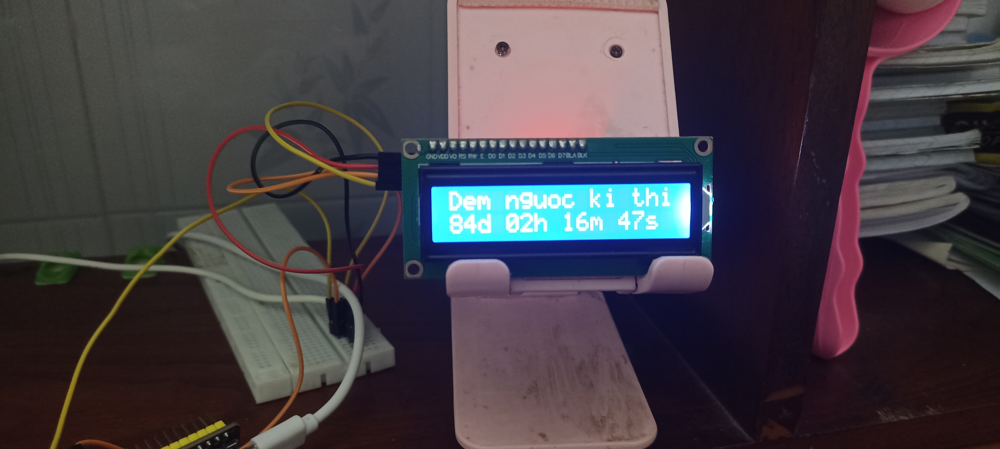
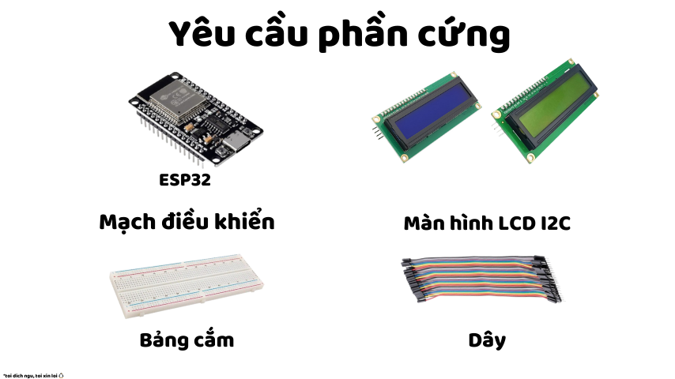
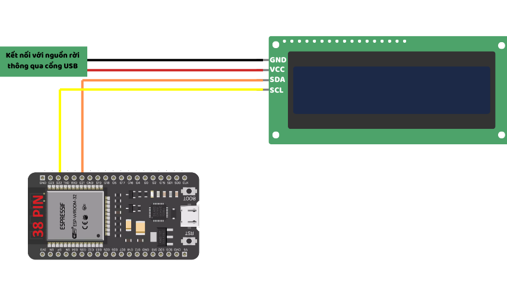

# 📆 Đếm ngược kì thi tuyển sinh bằng ESP32 📆

<p align="center">
  
</p>

Bạn muốn có một chiếc "đồng hồ" nhỏ để trên bàn giúp đếm ngược ngày thi? Đây sẽ là hướng dẫn giúp bạn tự làm một cái ngay tại nhà mà giá chỉ đâu đấy 50-200k thôi nha!
**⚠️ Lưu ý:** API mình sử dụng ở đây là do **mình tự chỉnh theo thông tin của Bộ Giáo Dục hoặc ước tính nha!** Và nó chỉ hoạt động dựa trên lịch địa bàn **Thành phố Cần Thơ**. Thông tin chi tiết mình sẽ để ở dưới cho bạn nào muốn chỉnh

---

## 📖 Mục lục
- [📌 Yêu cầu phần cứng](#-yêu-cầu-phần-cứng)
- [⚙️ Cài đặt](#️-cài-đặt)
  - [💾 Đối với file .ino (Arduino)](#-đối-với-file-ino-arduino)
  - [🐍 Đối với MicroPython](#-đối-với-micropython)
- [📆 Đổi ngày thi](#-đổi-ngày-thi)
- [🤝 Đóng góp](#-đóng-góp)
---

## 📌 Yêu cầu phần cứng
- **Bo mạch điều khiển:**
  - 1 ESP32 (bạn có thể chọn phiên bản 32 hoặc 38 chân, không khác là mấy đâu trừ khi bạn nghich 🐧)
- **Màn hình:** 1 LCD I2C (Xanh lá hoặc xanh dương tùy bạn và hãy nhớ **mua loại hàn sẵn mạch I2C để đỡ tốn công hàn thêm nha**)
- **Phụ kiện khác:**
  - 1 Breadboard (Tùy chọn)
  - Dây nối 

<p align="center">
  
</p>

---

## ⚙️ Cài đặt

### 🔌 Kết nối phần cứng
1. Kết nối ESP32 với màn hình LCD I2C theo sơ đồ sau:
<p align="center">
  
</p>

> **Lưu ý:** Đây là sơ đồ mẫu cho ESP32 loại 38 chân nhé! (SCL: chân G23, SDA: chân 21).

---

### 💾 Đối với file .ino (Arduino)
1. Tải xuống firmware mới nhất từ [RELEASES](https://github.com/chezzakowo/ArduinoThing/releases):
   - Phiên bản mới nhất: **[0.1.0](https://github.com/chezzakowo/ArduinoThing/releases/0.1.0)**
     - File MicroPython: [Tải về](https://github.com/chezzakowo/ArduinoThing/releases/download/0.1.0/Code_MicroPython-ESP32.zip)
     - File .ino: [Tải về](https://github.com/chezzakowo/ArduinoThing/releases/download/0.1.0/ArduinoDemNguoc.ino)

2. Mở file `.ino` và chỉnh sửa cấu hình Wi-Fi:
```cpp
// Your Wi-Fi credentials
#define WIFI_SSID     "TÊN WIFI CỦA BẠN"  // Thay bằng tên Wi-Fi của bạn
#define WIFI_PASSWORD "MẬT KHẨU WIFI CỦA BẠN"  // Thay bằng mật khẩu Wi-Fi của bạn
```

> **Lưu ý:**  
> - Nếu ESP32 chỉ hỗ trợ **Wi-Fi 2.4 GHz**, hãy đảm bảo kết nối với mạng **2.4 GHz**, không phải 5 GHz.

2.5 (**Tùy chọn**) Chỉnh thời gian tắt / bật màn hình theo giờ
Để chỉnh thời gian màn hình bật tắt theo giờ, bạn có thể chỉnh cái này trong `Main.py` nhé!
```cpp
// Times of day to turn the screen OFF and ON
// (use 24-hour format, HH:MM)
const char* TURN_OFF_SCREEN_TIME[] = {"00:15", "06:30"};
const char* TURN_ON_SCREEN_TIME[]  = {"06:10", "11:45"};
```
Trong ví dụ trên, mình đã để màn hình có 2 khung giờ bật tắt.
 - **Thời gian 1**: (**Tắt**) 00:15 -> (**Bật**) 06:10
 - **Thời gian 2**: (**Tắt**) 06:30 -> (**Bật**) 11:45
Bạn có thể chỉnh 1 cái danh sách bật tắt theo giờ bạn thích và nhớ là **chỉnh theo thứ tự của danh sách nhé** và nó **không có giới hạn** bạn đặt đâu

3. Nạp chương trình lên ESP32, chờ nó kết nối Wi-Fi. Nếu thấy kết quả như dưới đây, bạn đã thành công!

<p align="center">
  
</p>
<p align="center">
  
</p>
---

### 🐍 Đối với MicroPython
Trong hướng dẫn này, mình sử dụng **PyMakr** trên Visual Studio Code, bạn có thể dùng công cụ khác tùy thích.

1. Giải nén file `.zip` vào một thư mục.
2. Cài đặt **PyMakr** trên VS Code.
3. Mở `Main.py` và sửa thông tin Wi-Fi:
```python
# Cấu hình Wi-Fi
SSID = "TÊN WIFI CỦA BẠN"  # Thay bằng tên Wi-Fi của bạn
PASSWORD = "MẬT KHẨU WIFI CỦA BẠN"  # Thay bằng mật khẩu Wi-Fi của bạn
```
3.5 (**Tùy chọn**) Chỉnh thời gian tắt / bật màn hình theo giờ
Để chỉnh thời gian màn hình bật tắt theo giờ, bạn có thể chỉnh cái này trong `Main.py` nhé!
```python
# Thời gian bật/tắt màn hình
Turn_Off_Screen_Time = ["00:15", "06:30"]
Turn_On_Screen_Time = ["06:10", "11:45"]
```
Trong ví dụ trên, mình đã để màn hình có 2 khung giờ bật tắt.
 - **Thời gian 1**: (**Tắt**) 00:15 -> (**Bật**) 06:10
 - **Thời gian 2**: (**Tắt**) 06:30 -> (**Bật**) 11:45
Bạn có thể chỉnh 1 cái danh sách bật tắt theo giờ bạn thích và nhớ là **chỉnh theo thứ tự của danh sách nhé** và nó **không có giới hạn** bạn đặt đâu

4. Mở **PyMakr**, kết nối với ESP32 và tải file lên.
5. Khởi động lại ESP32. Nếu thấy thông báo kết nối thành công, bạn đã hoàn tất!

<p align="center">
  
</p>

## 📆 Đổi ngày thi
API mình sử dụng là từ [chezzakowo/demnguockithiC3CanTho](https://github.com/chezzakowo/demnguockithiC3CanTho/blob/main/api/demnguoc/lichthi.json) và thông tin lịch thi được lưu dưới định dạng ``lichthi.json``

**File `lichthi.json` mẫu**
```json
{
  "trang_thai": "chinh_thuc",
  "ngay": 5,
  "thang": 6,
  "nam": 2025,
  "gio": 0,
  "phut": 0,
  "giay": 0
}
```

Để thay đổi ngày, bạn chỉ cần thay giá trị **ngay, thang, nam** thôi và bạn có thể tải nó lên Github lại để làm "**server API**"!

Để thay đổi **API lấy lịch thi**, bạn có thể chỉnh như sau:
- **🐍 Đối với MicroPython**

Thay biến **Lich_Thi_API** với **địa chỉ URL tới file lichthi.json** của bạn
```python
# API Lịch thi
Lich_Thi_API = "" #Thay bằng URL chứa file lichthi.json
```

- **💾 Đối với file .ino (Arduino)**
Thay biến **Lich_Thi_API** với **địa chỉ URL tới file lichthi.json** của bạn
```cpp
// The API URL that returns JSON data for exam schedule
#define LICH_THI_API
```

## 🤝 Đóng góp 
Đây là những người đóng góp vô dự án! Bạn có thể đóng góp bằng cách báo lỗi và update nếu muốn nhe!

<a href="https://github.com/chezzakowo/LunarSMP-Archive/graphs/contributors">
  
</a>